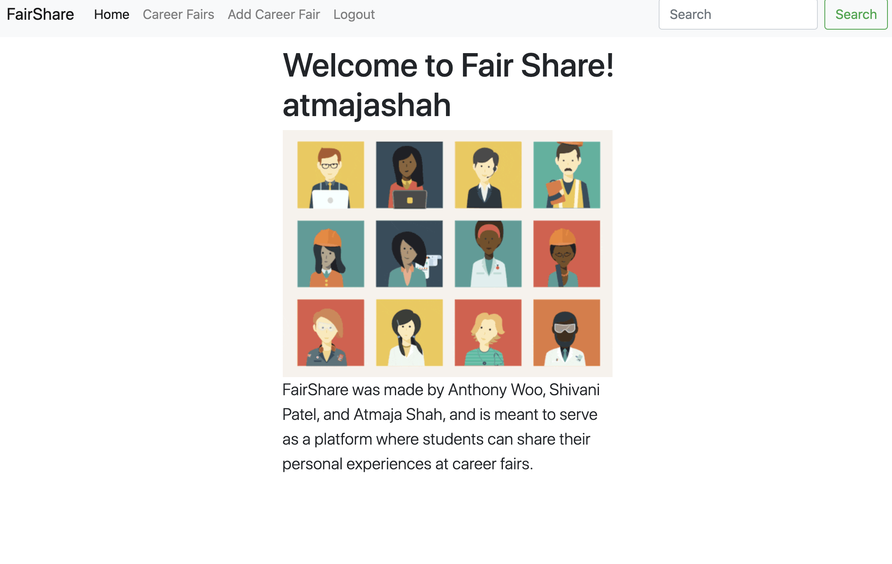
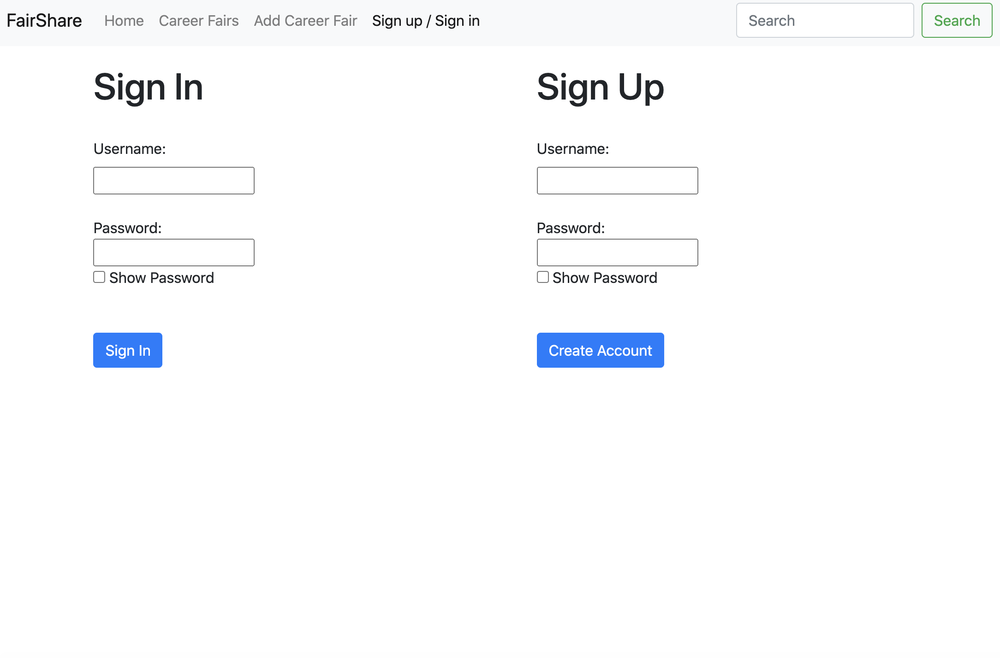
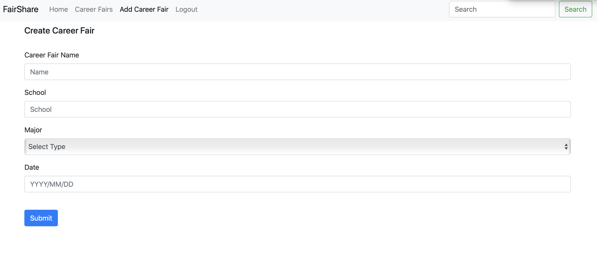
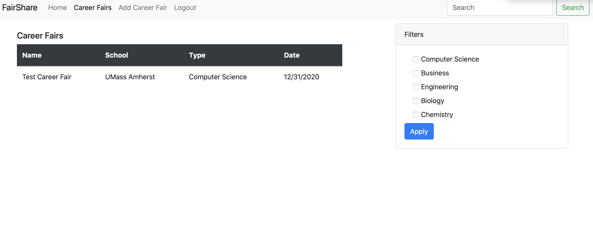
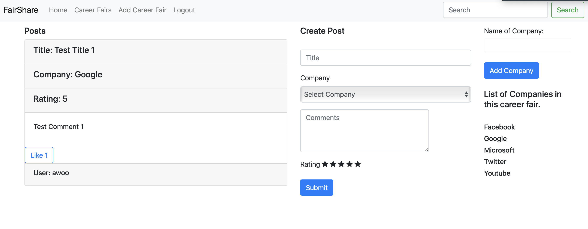

## Team Name: zayin

## Application Name: FairShare

## Semester: Fall 2020

## Application Overview:
Fair Share is an application intended to enable students to share their experiences at career fairs with their peers and interact with them on the subject. Inspired by a feature on the career networking platform Handshake where students can share their experience working at a company, we felt it would be useful for students to share and exchange notes about their experiences at career fairs (such as interacting with talent acquisition employees, what certain companies look for over others, and much more)—especially since this concept has not been implemented yet. The core objective of this application is achieved by allowing students to make accounts with FairShare, add posts relating their personal experiences at specific career fairs, and interact with other posts by liking posts. 

## Team Overview:
Members: Anthony Woo, Atmaja Shah, Shivani Patel 

GitHub Usernames: anthonytwoo, atmajashah, shipatel

## User Interface:
-Home Page:
        
    - The home page welcomes the user to FairShare, and gives them an overview of the web application. There is a navigation bar at the top that allows users to navigate to other pages (regardless of what page they are on).
-Sign Up/Sign In Page:
        
    - The sign up and sign in page allows the user to either create an account or login to if they have an exisiting account. Before the user signs in (or creates and account and signs in), they will only be able to view the home page and the sign up and sign in page. When a user creates an account, they will be prompted with a message that it was successfully created. If they use a preexisting username when they create an account, they will not be able to do so and they will be prompted with a message that they cannot use the username. When a user signs in with incorrect login credentials, it will prompt them with a message that they entered the incorrect username or password. Otherwise, they will be able to login and access all the features of the web application. If they click on any page in the navigation bar without being signed in, they will be redirected to the sign up and sign in page.
-Add Career Fair Page
        
    - The add career fair page allows users to add career fairs that they have attended or may attend, so that they can create posts within that specific career fair. In order to add a career fair, the user fills out a form with the name of the career fair, the schools involved in the career fair, the majors or fields that are targeted for the career fair, and the date that it is taking place.
-List of Career Fairs Page
        
    -This page presents the lists of career fairs that have been added by users. Users can click on an individual career fair, and this will navigate to a page with a list of posts for that specific career fair. 
-Post Page for a Career Fair
        
    -This page presents all of the posts that users have posted for a specific career fair, and allows users to create their own posts and interact with other posts (by liking). It should be noted that each career fair will have its own post page. 
## APIs:

* /cf
  * checks to see if user is logged in
  * gets list of career fairs from the database (careerfairs table)
  * accessed by clicking "Career Fairs" tab
* /cf/:careerfairId
  * checks to see if user is logged in
  * gets list of posts from the database according to a specific career fair ID (careerfairs table)
  * accessed by clicking on a specific career fair on the "Career Fairs" page
* /cfCompany/:careerfairID
  * checks to see if user is logged in
  * gets list of companies from the database according to a specific career fair ID (companies table)
  * accessed by clicking on a specific career fair on the "Career Fairs" page
* /create-cf
  * checks to see if user is logged in
  * posts a new, user created, career fair, which is then added to the database
  * adds career fair name, school it was held at, type of career fair, and date of the fair to careerfairs table
  * accessed by clicking on the "Create Career Fair" button and posts data from populated fields
* /getPost/:postId
  * checks to see if user is logged in
  * displays post based on the post id (posts table)
* /likeCount/:postId
  * checks to see if user is logged in
  * displays like Count based on the post id (likes table) 
* /postCompany/:postId
  * checks to see if user is logged in
  * displays company name based on the post id (companies table)
* /addLike
  * checks to see if user is logged in
  * inserts row into likes table where the post ID and username have to be a unique combination
* /create-post
  * checks to see if user is logged in
  * posts a new, user created, post, which is then added to the database
  * adds career fair name, company, username, rating, and comment to the posts table
  * accessed by clicking on the "Create Post" button on the "Career Fairs" page and posts data from populated fields
* /editPost/:postId
  * checks to see if user is logged in
  * ability to edit, user created, post, which is then updated in the database
  * edits career fair name, company, username, rating, and comment in the posts table based on post ID
  * accessed by clicking on the "Edit" button on a specific Career Fair page and posts data from populated fields
* /deletePost/:postId
  * checks to see if user is logged in
  * deletes a user created post which is then removed the database
  * removes an instance from the posts table based on post ID
  * accessed by clicking on the "Delete" button on a specific Career Fair page
* /sign-up
  * allows user to sign up for an account
  * if unique username and appropriate password is provided, the data from the populated fields is used to create a new instance in the users table and a success message is displayed
  * if above criteria is not met, nothing is added to database and an error message is displayed
  * accessed by clicking "Sign Up" on the "Sign in/Sign up" page
* /sign-in
  * allows user to sign into their account
  * if proper login info is provided, user is allowed to access private pages (users table)
  * if above criteria is not met, an error message is displayed
  * accessed by clicking "Sign In" on the "Sign in/Sign up" page
* /cf/:careerfairId/addCo
  * checks to see if user is logged in
  * adds a company to a certain career fair based on career fair ID (companies table)
  * accessed by clicking on the "Add Company" button on a specific Career Fair page

## Database:

CREATE TABLE Users (
	username varchar(255),
	salt varchar(255),
	hash varchar(255),
	PRIMARY KEY (username)
);

Users Table
| Column       | Data Type | Description                                      |
|--------------|-----------|--------------------------------------------------|
| username     | String    | The user’s unique identifier                     |
| salt         | String    | Random data used as an input to a function that  |                  
|              |           | hashes data                                      |
| hash         | String    | Used to pair keys to values                      |

CREATE TABLE CareerFairs (
	careerFairID SERIAL,
	careerFairName varchar(255),
	type varchar(255),
	school varchar(255),
	date date,
	PRIMARY KEY (careerFairID)
);

CareerFairs Table
| Column           | Data Type | Description                                  |
|------------------|-----------|----------------------------------------------|
| careerFairID     | SERIAL    | The career fair’s unique identifier          |
| careerFairName   | String    | The name of a particular career fair         |                  
| type             | String    | Type of career fair (subjects/specialties    |                               
| school           | String    | The school that the fair was hosted at       |
| date             | date      | The date of the career fair                  |

CREATE TABLE Companies (
	companyID SERIAL,
	companyName varchar(255),
	careerFairID int,
PRIMARY KEY (companyID),
FOREIGN KEY (careerFairID) REFERENCES CareerFairs(careerFairID)
);

Companies Table
| Column           | Data Type | Description                                  |
|------------------|-----------|----------------------------------------------|
| company ID       | SERIAL    | The company’s unique identifier              |
| companyName      | String    | The name of a particular company             |                        
| careerFairID     | Integer   | The career fair’s unique identifier          |   
|                  |           | (references careerFairs table)               |

CREATE TABLE Posts (
	postID SERIAL,
	username varchar(255),
	careerFairID int,
	companyID int,
	Title varchar(255),
	Rating int,
	Comment varchar(2000),
	PRIMARY KEY (postID),
	FOREIGN KEY (username) REFERENCES Users(username)
	FOREIGN KEY (careerFairID) REFERENCES CareerFairs(careerFairID),
	FOREIGN KEY (companyID) REFERENCES Companies(companyID)
);

Posts Table
| Column           | Data Type | Description                                  |
|------------------|-----------|----------------------------------------------|
| PostID           | SERIAL    | The post’s unique identifier                 |
| username         | String    | The unique name of the user who created the  |
|                  |           | post (references the Users table)            |                 
| careerFairID     | Integer   | The unique identifier of a particular career |  
|                  |           | fair (references the careerFairs table)      |         
| companyID        | Integer   | The unique identifier of a particular company|  
|                  |           | (references the Companies table)             |  
| Title            | String    | Title of the post set by user                |                               
| Rating           | Integer   | Evaluates the career fair on a scale from 1-5|   
| Comment          | String    | A comment where the user can enter upto 2000 |  
|                  |           | characters regarding the specifics of their  |         
|                  |           | fair experience                              |

CREATE TABLE Likes (
	postID int,
	username varchar(255)
	FOREIGN KEY (postID) REFERENCES Posts(postID),
	FOREGIN KEY (username) REFERENCES Users(username)
);

Likes Table
| Column           | Data Type | Description                                  |
|------------------|-----------|----------------------------------------------|
| PostID           | SERIAL    | The liked post’s unique identifier           |      
|                  |           | (references the Posts table)                 |
| username         | String    | The unique name of the user who liked the    |
|                  |           | post (references the Users table)            |   

## URL Routes/Mappings:

| URL Routes          		  | Description                                              |
|---------------------------------|----------------------------------------------------------|
| career-fair-list     		  | Used to obtain a list of all available career fairs in   |      
| 		    	          | the database. Accessed by clicking the "Career Fairs"    |
|				  | button at the top of every page. Requires users to login |
|				  | before they can access the page			     | 
| career-fair/:careerfairId       | Used to access a list of all posts that have the same    | 
| 			          | career fair ID. Accessed by clicking on a particular     |
|				  | career fair on the "Career Fairs" page. Requires users   |
|			          | to login before they can access the page		     | 
| create-career-fair	          | Used to create a career fair. Accessed by clicking the   | 
| 			          | "Add Career Fair" button at the top of the page. Requires|
|			  	  | users to login before they can access the page	     |
| edit-post/:cfId/:postId	  | Takes user to a page where they can edit their post      | 
| 			          | based on ID. Accessed by clicking the "Edit" button      |
|				  | underneath their post. Requires users to login before    | 
| 			          | they can access the page				     | 
| sign-in			  | Used to access the sign in and sign up page. Accessed    | 
| 			          | by clicking the "Sign up/Sign in" button at the top of   |
|				  | the page     			    		     | 
| private			  | Once the user has logged in, it takes in the request     |
|				  | username and redirects to /private/:username/ which takes| 
|				  | users to the private homepage. Checks to see if user is  |
|				  | signed in before they can access the home page	     | 
| private/:username		  | Takes user to the private homepage from /private/. Checks|
|				  | to see if user is signed in before they can access the   |
|				  | homepage						     | 
| logout			  | Takes user to the public homepage. Accessed by clicking  |
|				  | the "Logout" button at the top of the screen. Must be    |
|				  | signed in to see this button.			     |

## Authentication/Authorization:
The process of authenticating a user proceeds as follows: When a user creates an account, they enter a username and password; the database stores the username as is, however it encrypts the password with a salt and hash and stores the hash in the database. If the username already exists, the server returns a message to inform the user that they cannot use the username. However, if the username does not exist, the server returns a message to inform the user that their account was successfully created. When a user signs in, they enter their username and password. Once the server receives the username and password, it first checks the database to see if the username exists. Since the actual password is not stored in the database, the server checks for the salt and hash values associated with the specific username. If the password authentication fails or the username does not exist in the database, then the server will return a message to inform the user that they entered the incorrect username or password. When sign in credentials are entered incorrectly, the server also times out for two seconds to prevent constant spamming of incorrect credentials. On the other hand, if the user has been authenticated successfully, they are automatically redirected to the homepage, where they are welcomed with their username. Once the user has signed in, they can create posts, interact with other posts, and access other pages. Once they logout, they will only be able to access the homepage. If they try to naviagte to any other page, it will automatically redirect them to the Sign up/Sign in page.

## Division of Labor:
#### Anthony Woo:
	- Navbar, Logout
	- Create Career Fair
	- Career Fair Table, Filter Feature
	- List of Posts, Create Post, Edit Post, Like/Edit/Delete Buttons
	- Helped with Debugging Add Company, Like & Delete Post Functions
	- Helped with Sign in / Sign up Front-end
#### Atmaja Shah:
	- Sign Up/Sign In (Front End/Back End/Authentication)
	- Original Create Post Page (Front End/Back End used for new Post page)
	- Home Page
	- Helped with layout of new Post Page
	- Star Rating (Functionality)
	- Final Documentation
#### Shivani Patel:
	- Mapped out layout of the website and database tables
	- Helped with debugging functions
	- Worked on deploying to Heroku
	- Add Company and Like functions
	- Helped with Sign in / Sign up front end and show/hide password feature
	- URL Routes, APIs, and database tables in markdown
	- Final Grading Rubric

## Conclusion:
Overall, the process of developing FairShare served as a valuable learning experience. My teammates and I were unfamiliar with Javascript, HTML, and CSS prior to this class, however, learning the relevant material in lecture helped us implement the various aspects of our web application that were required at each stage. While we struggled a bit in developing the wireframes, the implementation of the front-end of the web application with Javascript and the back-end of the web application with Node.js along with the integration proved to be much more challenging. It took time for us to figure out how to structure the endpoints, complete the corresponding back-end skeleton code, implement the database, and deploy the application to Heroku. However, going through this process with a team was very informative, because it provided an accurate representation of how web applications are developed in the real world (by that I mean in stages and generally with a team). One of us would always have something acting up or not working (whether someone was unable to get the local dummy server to work or had an endpoint malfunctioning among other problems). However, over the course of long Zoom sessions with eachother and help from the teaching assistants, we were able to complete the necessary tasks. I think more than anything, this project taught us the value of teamwork and not giving up when something is not working. It would have been useful to have prior familiarity with the coding languages, Heroku, and Postgres, so that we would not have spent so much time trying to properly design the foundation of the web application and could have made it final product more visually appealing. Nevertheless, it was very rewarding to see the final product come together.
