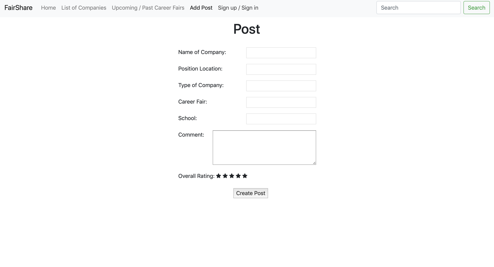
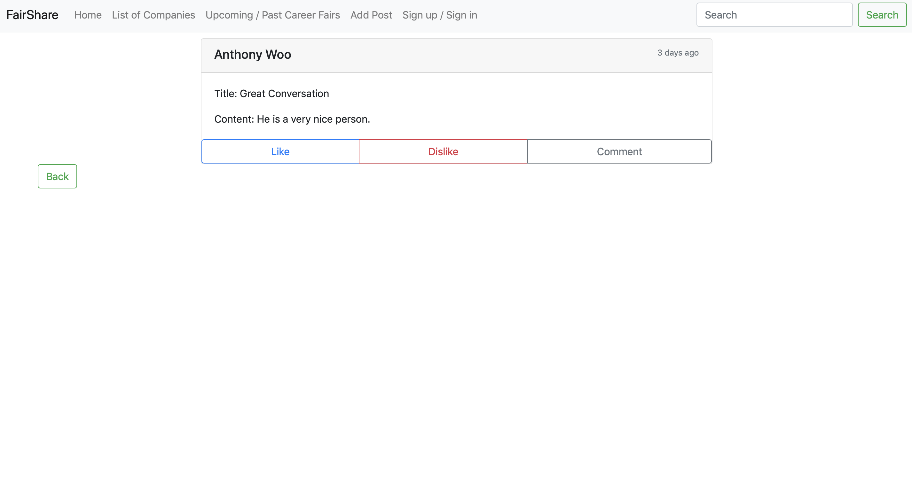

# Milestone 1: Project Wireframes

## Team Name: zayin

## Application Name: FairShare

## Team Overview:
Members: Anthony Woo, Atmaja Shah, Shivani Patel GitHub 
Usernames: anthonytwoo, atmajashah, shipatel

## Innovative Idea:
We want to create a website that allows students to talk about their experiences with recruiters at career fairs. It would be a platform where students can log in and talk about the questions they were asked, what positions the company was hiring for, how the overall interview/meeting went, and an overall rating of the person they spoke to. The website would list career fairs that have passed and each link will lead to a list of the companies that were present, there can be a helpful/not helpful rating in regards to the person's review of the company they spoke to.

## Important Components: 
In our web application, we want to implement features that allow users to exchange their personal experiences, and make this website a source that helps students to prepare for career fair. Our main function would be allowing users to create post/threads for their career fair experience. The post would include data such as "rating of your experience with this recruiter/company" for reference. We would also like to include a comment feature for other students to ask questions or comment on the posts. Along with comments, we would like to include a "helpful/not helpful" rating systems for simple feedback from users, so it is easy to identify if a post is good or bad. Some important components in our application would be the list of companies and list of career fairs from different schools. These data would be used for users to specify which company and which career fair they went to, and for users to sort or filter companies based on their own interests, and find posts and comments that are relevant.

- List of Companies
- List of Career Fairs
- Add Post
- Sign in/ sign up
- Search
- Detail of posts

## Data Interactions:

## Wireframe:

## HTML Interface:

## Division of labor:
#### Anthony Woo: 
List of Career Fairs, Search, Detail of posts
#### Atmaja Shah:
Home Page, Add Post (and Dynamic Star Rating in Javascript), Sign Up/Sign In
#### Shivani Patel:
